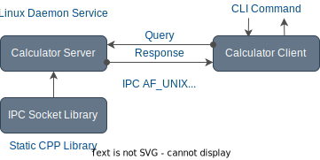

## Calculator CLI Project using IPC Socket and Linux Service

This project is simple calculator and provides Linux CLI functionality. CLI process communicates with Linux calculation service server via IPC UNIX Domain Socket.

*Author:Mehmet Kahraman*

*Date: 11.12.2023*


Project Architecture:
---



Installation:
---

Build:
```
mkdir build
cd build
cmake ..
make
sudo make install
```

Starting Service:
```
sudo systemctl daemon-reload
sudo systemctl start calculatord
sudo systemctl status calculatord
sudo journalctl --unit calculatord --follow
```

CLI Client Execution Examples:
---

Adding:
```
calculator_client add 6 2
```
> Client connected to server. 
>
> Client: Sending query: 1 6 2  
> Client: Received response: 8

Subtracting:
```
calculator_client subtract 6 2
```
> Client connected to server. 
>
> Client: Sending query: 2 6 2  
> Client: Received response: 4

Multiplying:
```
calculator_client multiply 6 2
```
> Client connected to server. 
>
> Client: Sending query: 3 6 2  
> Client: Received response: 12

Dividing:
```
calculator_client divide 6 2
```
> Client connected to server. 
>
> Client: Sending query: 4 6 2  
> Client: Received response: 3

Bonus! Python Socket Example:
---

Server:
```
python3 server.py
```
> Server program started  
> Server started to listening...
> 
> Server: client accepted.  
> Server: received query:  Hello world! from client.

Client:
```
python3 client.py
```
> Client: connected to server.  
> Client: received response: Hello world! from server.